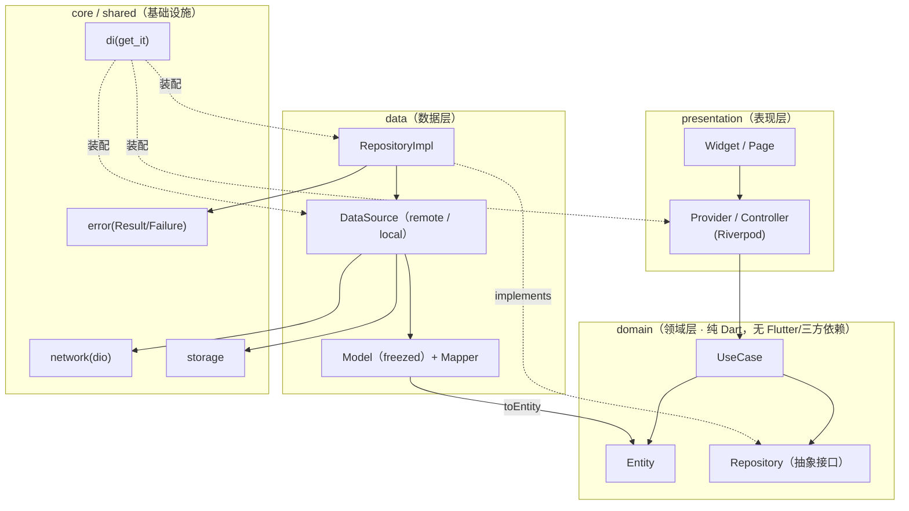
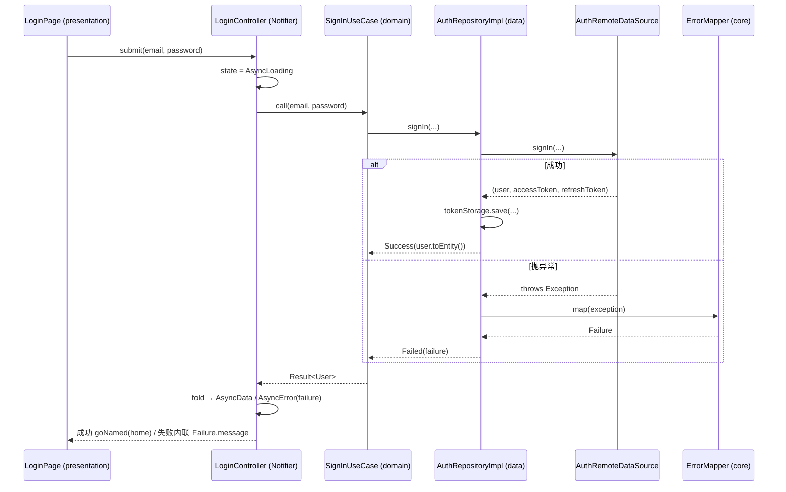
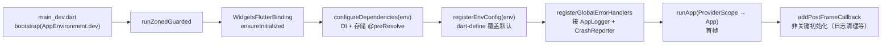

# 架构文档（ARCHITECTURE）

> 本项目采用 **Clean Architecture + Feature-First**。本文说明分层职责、依赖规则、目录映射、运行时数据流与启动流程。
> 配套阅读：[README](../README.md) · [上手指南](GETTING_STARTED.md) · [约定规范](CONVENTIONS.md)。

## 1. 架构总览



**核心思想**：依赖方向永远指向 `domain`。`domain` 不依赖任何外层（连 Flutter 都不导入），因此可独立单测、可替换实现。

## 2. 分层职责

| 层 | 目录 | 职责 | 允许依赖 | 禁止 |
|---|---|---|---|---|
| **presentation** | `features/*/presentation/` | UI 渲染、用户交互、把状态映射成 Widget | domain、shared、core | 直接调 DataSource / Dio / 存储 |
| **domain** | `features/*/domain/` | 业务规则：Entity、UseCase、Repository **接口** | 无（纯 Dart） | import `flutter`、`dio`、`freezed` 实现 |
| **data** | `features/*/data/` | Repository **实现**、DataSource、Model（freezed）+ Mapper | domain、core | 把 Model 泄漏到 presentation |
| **core** | `lib/core/` | 跨 feature 基础设施：DI、网络、存储、错误、路由、i18n、主题、日志、权限、安全、环境 | — | 依赖任何 `features/*` |
| **shared** | `lib/shared/` | 通用 UI 组件、扩展、工具、常量 | core | 依赖任何 `features/*` |

依赖规则（Dependency Rule）：

```
features/*  ─→  core / shared        ✅
features/A  ─→  features/B           ❌（feature 之间不互相依赖）
presentation ─→ domain ←─ data       ✅（data 实现 domain 的接口）
domain ─→ (任何外层)                  ❌（domain 是最内核）
```

## 3. 目录映射

```
lib/
├── main_{dev,staging,prod}.dart   # 环境入口：void main() => bootstrap(AppEnvironment.x)
├── main_showcase.dart             # 组件画廊入口
├── bootstrap.dart                 # 启动编排（见 §5）
├── app.dart                       # App = MaterialApp.router（主题/i18n/路由装配）
│
├── core/                          # 基础设施（不含业务）
│   ├── di/        # get_it + injectable（injection.dart / injection.config.dart）
│   ├── error/     # exceptions.dart / failures.dart / result.dart / error_mapper.dart
│   ├── network/   # dio 实例 + interceptors(auth/log/error/retry)
│   ├── storage/   # KeyValueStorage / SecureTokenStorage / Hive
│   ├── router/    # app_router.dart / typed_routes / auth_redirect / route_names
│   ├── i18n/      # locale_provider（运行时切换 + 持久化）
│   ├── theme/     # tokens + ThemeData + ThemeExtension + theme_mode_provider
│   ├── logger/    # AppLogger + CrashReporter
│   ├── env/       # AppEnvironment / EnvConfig（dart-define 解析）
│   ├── security/  # ScreenSecurity / DeviceIntegrity
│   ├── responsive/ observer/ permission/ lifecycle/ ...
│
├── shared/        # widgets/（AsyncValueWidget、AppRefreshList、states…）extensions/ utils/ constants/
│
├── features/      # 业务模块（每个内部含 domain/data/presentation）
│   ├── auth/      # 登录（M19/T19.1）
│   ├── home/      # 首页（M19/T19.2）
│   ├── detail/    # 详情（M19/T19.3）
│   ├── settings/  # 设置（M19/T19.4）
│   ├── permission_demo/  # 权限演示（M19/T19.5）
│   ├── examples/  # 各模块演示页（router_demo 等）
│   └── showcase/  # 组件画廊
│
├── l10n/          # *.arb + 生成的 AppLocalizations
└── gen/           # flutter_gen 生成的资源引用
```

## 4. 运行时数据流（以「登录」为例）



**约定**：
- 跨层返回值统一用 `Result<T>`（`Success` / `Failed`），**不**向上抛异常；异常只在 `data` 层被 `ErrorMapper` 归一化为 `Failure`。
- `Result.fold(...)` 是定义在 `core/error/result.dart` 的**扩展方法**，使用处必须 import 该文件。
- Model（`data`）只在 `data` 层流转，跨层前由 Mapper 转成 Entity（`domain`）。

## 5. 启动流程（bootstrap）

`lib/bootstrap.dart` 把启动分为**关键路径**（阻塞首帧）与**非关键路径**（首帧后延迟），整体包在 `runZonedGuarded` 内兜底未捕获异步异常。



`App`（`app.dart`）装配 `MaterialApp.router`：注入主题（M10）、本地化（M08）、`go_router`（M07）。路由由 `core/router/app_router.dart` 定义，`authRedirect` 守卫读取 `isLoggedInProvider` 决定是否重定向到 `/login`。

## 6. 关键横切设计

| 关注点 | 方案 | 入口 |
|---|---|---|
| 依赖注入 | `get_it` + `injectable`，按环境名注册（`@dev`/`@Environment`） | `core/di/injection.dart`（`configureDependencies(environment:)`） |
| 状态管理 | Riverpod **手写 Provider** 模式（不使用 riverpod_generator，原因见 [ADR-0001](adr/0001-handwritten-providers-over-codegen.md)） | `features/*/presentation/providers/` |
| 错误处理 | `Exception → Failure → Result<T>` + 全局 `runZonedGuarded` + `FlutterError.onError` | `core/error/` |
| 路由 | `go_router` + `go_router_builder` 类型安全 + `StatefulShellRoute` 嵌套 Tab + 守卫 | `core/router/` |
| 多环境 | `EnvConfig` + `--dart-define-from-file` + 三 flavor | `core/env/` |
| 测试替身 | Repository/UseCase 用 `mocktail` Mock 或手写 Fake，Provider 用 `ProviderContainer` overrides | `test/` |

## 7. 为什么这样分层

- **可测试**：`domain` 纯 Dart，UseCase / Repository 接口可零依赖单测；presentation 用 `ProviderContainer.overrides` 注入假实现。
- **可替换**：换网络库 / 存储库只动 `data` + `core`，`domain` 与 `presentation` 不变。
- **可并行**：Feature-First 让不同业务模块互不依赖，多人可并行开发。
- **低耦合**：`Result<T>` 统一错误通道，UI 不需要 try/catch 散落各处。

## 环境快照

Flutter 3.41.9 · Dart 3.11.5 · Clean Architecture + Feature-First · get_it/injectable · flutter_riverpod · go_router。
